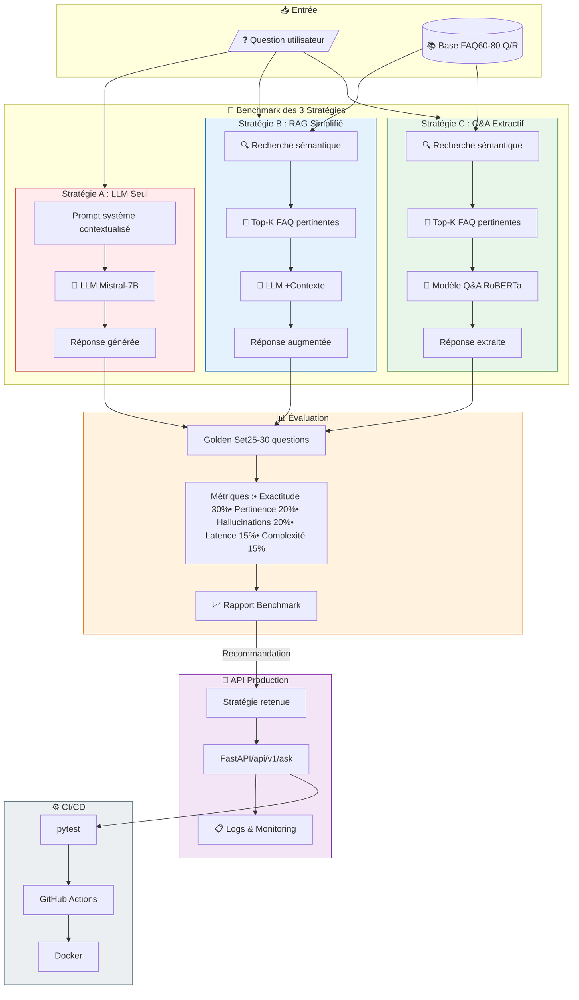
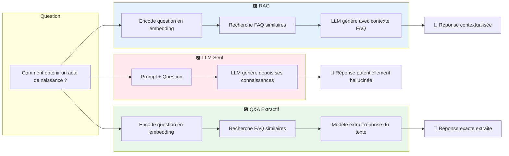

# 🤖 Assistant FAQ Intelligent - Collectivité Territoriale

[](https://www.python.org/downloads/)
[](https://fastapi.tiangolo.com/)
[](https://opensource.org/licenses/MIT)

## 📋 Description

API REST d'assistance FAQ pour la Communauté de Communes Val de Loire Numérique. L'assistant répond aux questions des citoyens sur les démarches administratives en s'appuyant sur une base de connaissances structurée.

## 🎯 Vue d'ensemble du projet



### 🔀 Comparaison des Stratégies - Exemple



## 🏗️ Architecture du projet

```txt
.
├── src/
│   ├── strategies/          # Les 3 stratégies de réponse
│   │   ├── __init__.py
│   │   ├── base.py          # Classe abstraite commune
│   │   ├── strategy_a_llm.py
│   │   ├── strategy_b_rag.py
│   │   └── strategy_c_qa.py
│   ├── api/                 # API FastAPI
│   │   ├── __init__.py
│   │   ├── main.py
│   │   ├── routes.py
│   │   └── models.py
│   ├── utils/               # Utilitaires
│   │   ├── __init__.py
│   │   ├── embeddings.py
│   │   ├── llm_client.py
│   │   └── logging_config.py
│   └── tests/               # Tests
│       ├── __init__.py
│       ├── test_strategies.py
│       ├── test_api.py
│       └── test_regression.py
├── data/
│   ├── faq_base.json        # Base FAQ fournie
│   ├── golden_set.json      # Jeu de test fourni
│   └── grille_evaluation.csv
├── docs/
│   ├── BRIEF_PROJET.md
│   ├── NOTE_CADRAGE.md
│   ├── RAPPORT_VEILLE.md
│   └── RAPPORT_BENCHMARK.md
├── scripts/
│   ├── run_benchmark.py
│   └── evaluate_results.py
├── .github/
│   └── workflows/
│       └── ci.yml
├── Dockerfile
├── docker-compose.yml
├── requirements.txt
├── .env.example
└── README.md
```

## 🚀 Installation

### Prérequis

- Python 3.10 ou supérieur
- pip ou conda
- Git
- (Optionnel) Docker

### Installation locale

1. **Cloner le repository**
```bash
git clone <votre-repo>
cd projet-faq-intelligent
```

2. **Créer un environnement virtuel**
```bash
python -m venv venv
source venv/bin/activate  # Linux/Mac
# ou
venv\Scripts\activate     # Windows
```

3. **Installer les dépendances**
```bash
pip install -r requirements.txt
```

4. **Configurer les variables d'environnement**
```bash
cp .env.example .env
# Éditer .env avec votre token HuggingFace si nécessaire
```

5. **Vérifier l'installation**
```bash
python -c "import sentence_transformers; print('OK')"
```

### Installation Docker (optionnel)

```bash
docker-compose up --build
```

## 📖 Utilisation

### Lancer l'API

```bash
uvicorn src.api.main:app --reload --port 8000
```

L'API est accessible sur `http://localhost:8000`

Documentation interactive : `http://localhost:8000/docs`

### Tester une question

```bash
curl -X POST "http://localhost:8000/api/v1/ask" \
  -H "Content-Type: application/json" \
  -d '{"question": "Comment obtenir un acte de naissance ?"}'
```

### Lancer les tests

```bash
# Tous les tests
pytest

# Avec couverture
pytest --cov=src --cov-report=html

# Tests de non-régression uniquement
pytest src/tests/test_regression.py -v
```

### Exécuter le benchmark

```bash
python scripts/run_benchmark.py
```

## 🔧 Configuration

### Variables d'environnement

| Variable | Description | Défaut |
|----------|-------------|--------|
| `HF_API_TOKEN` | Token HuggingFace (optionnel pour modèles publics) | - |
| `LLM_MODEL` | Modèle LLM à utiliser | `mistralai/Mistral-7B-Instruct-v0.2` |
| `EMBEDDING_MODEL` | Modèle d'embeddings | `all-MiniLM-L6-v2` |
| `LOG_LEVEL` | Niveau de logging | `INFO` |
| `CONFIDENCE_THRESHOLD` | Seuil de confiance minimal | `0.5` |

## 📊 Métriques exposées

L'endpoint `/metrics` expose :

- `faq_requests_total` : Nombre total de requêtes
- `faq_response_latency_seconds` : Latence moyenne
- `faq_low_confidence_total` : Nombre de réponses "je ne sais pas"

## 📝 Documentation

- [Brief projet](docs/BRIEF_PROJET.md)
- [Note de cadrage](docs/NOTE_CADRAGE.md)
- [Rapport de veille](docs/RAPPORT_VEILLE.md)
- [Rapport de benchmark](docs/RAPPORT_BENCHMARK.md)

## 🧪 Tests

Le projet inclut :

- **Tests unitaires** : Validation des fonctions individuelles
- **Tests d'intégration** : Validation des endpoints API
- **Tests de non-régression** : Validation sur le golden set avec seuil de qualité

## 👤 Auteur

Rémi Julien

## 📄 Licence

MIT
